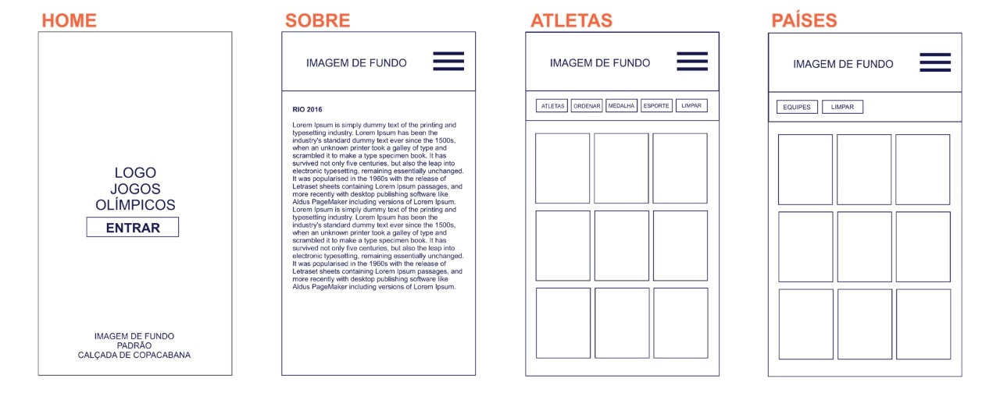
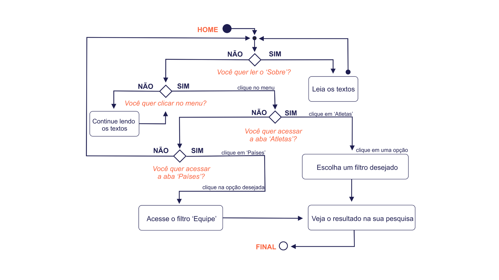

<h1 align="center"> Jogos Olímpicos Rio 2016 </h1>
<h4 align="center">Design Thinking Week </h4>

---

## Índice

- [Descrição](#descrição)
- [Personas](#Personas)
- [Protótipo de baixa fidelidade](#Protótipo-de-baixa-fidelidade)
- [Fluxograma](#Fluxograma)
- [Protótipo de alta fidelidade](#Protótipo-de-alta-fidelidade)
- [Tecnologias Utilizadas](#Tecnologias-Utilizadas)
- [Desenvolvido por](#desenvolvido-por)

## Descrição

O projeto Almanaque Olímpico, foi escolhido por nós por ser um tema muito interessante. Nele, refatoramos uma aplicação web baseada no banco de dados, onde continham os dados de cada atleta participante dos jogos Olímpicos do Rio 2016, como idade, sexo, país, entre outros.

Durante a Design Thinking Week, buscamos todas as informações sobre o tema, e sobre perfis de usuarios para que soubessemos como agregar melhorias na usabilidade de nossa aplicação.

Nossa aplicação tem três vertentes para que o usuário possa navegar, sendo elas, a página "Home", onde o usuário poderá ler sobre curiosidades e informações sobre as olímpiadas do Rio 2016, a página "Atletas", onde o usuário tem a possibilidade de pesquisar os atletas pelo nome, ordenar de A-Z e Z-A, filtrar pela medalha ganha nos jogos e também filtrar pelo esporte que cada atleta pratica, e por fim a página "Países", nela há a possibilidade de filtrar cada país por ordem alfabética crescente e decrescente, os cards apresentados nesta tela contém também, a quantidade de atletas de acordo com cada país.

## Personas

Definimos duas personas como usuários para adequar uma aplicação que se baseasse em suas necessidades.
Beatriz, 37 anos - Educadora.
Serena, 29 anos - Fã das olimpiadas e esportes.

#### Protótipo de baixa fidelidade

## Fluxograma

#### Protótipo de alta fidelidade

Por se tratar de um projeto responsivo criamos o protótipo de alta fidelidade para os dispositivos mais utilizados: smartphone, notebook/desktop e tablet.
Todos os protótipos de alta fidelidade foram desenvolvidos através da ferramenta [Figma](https://www.figma.com/file/0m0Zwxst6GeezXK5OVuOMI/Prot%C3%B3tipo-de-alta-fidelidade---Data-Lovers---Ol%C3%ADmpiadas-(Copy---Squad-8)?node-id=209%3A3)

## Tecnologias Utilizadas

- HTML5
- CSS3
- JavaScrip
- Node.js
- Git
- Figma
- Jest

## Desenvolvido por

Amanda Gusmão - [LinkedIn] (https://www.linkedin.com/in/gusmaoamanda/) - [GitHub] (https://github.com/amandagusmao/)

Aline Rosa Cruz - [LinkedIn](https://www.linkedin.com/in/aline-rosa-cruz/) - [GitHub](https://github.com/alinerc27/)

Layssa Aragão - [LinkedIn](https://www.linkedin.com/in/layssaaragaob/) - [GitHub](https://github.com/aragaolala/)

Larissa Santos - [LinkedIn](https://www.linkedin.com/in/larissa-dos-reis-santos-aaa8b415a/) - [GitHub](https://github.com/Larasantos97)
